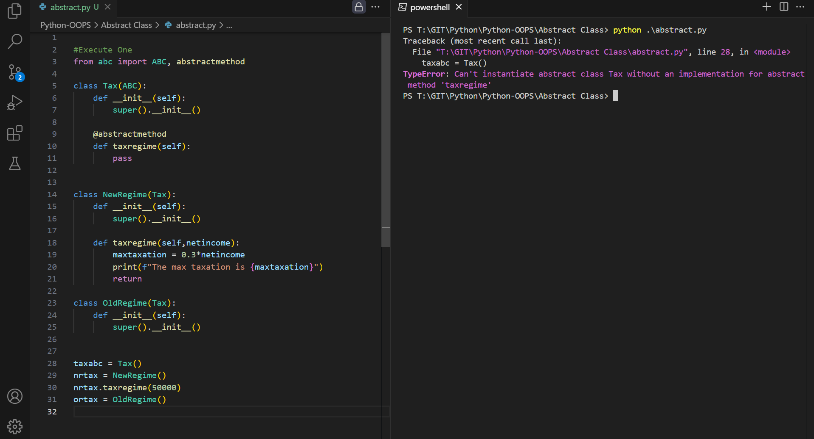
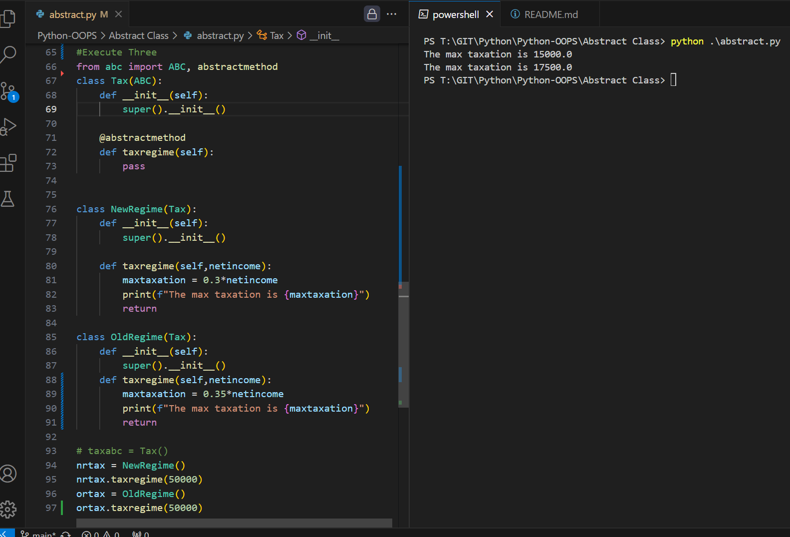

Execute One

```py

#Execute One
from abc import ABC, abstractmethod

class Tax(ABC):
    def __init__(self):
        super().__init__()
    
    @abstractmethod
    def taxregime(self):
        pass


class NewRegime(Tax):
    def __init__(self):
        super().__init__()
    
    def taxregime(self,netincome):
        maxtaxation = 0.3*netincome
        print(f"The max taxation is {maxtaxation}")
        return 

class OldRegime(Tax):
    def __init__(self):
        super().__init__()
    
    
taxabc = Tax()
nrtax = NewRegime()
nrtax.taxregime(50000)
ortax = OldRegime()


```

Outcome



Execute Two

```py
#Execute Two
from abc import ABC, abstractmethod

class Tax(ABC):
    def __init__(self):
        super().__init__()
    
    @abstractmethod
    def taxregime(self):
        pass


class NewRegime(Tax):
    def __init__(self):
        super().__init__()
    
    def taxregime(self,netincome):
        maxtaxation = 0.3*netincome
        print(f"The max taxation is {maxtaxation}")
        return 

class OldRegime(Tax):
    def __init__(self):
        super().__init__()
    
    
# taxabc = Tax()
nrtax = NewRegime()
nrtax.taxregime(50000)
ortax = OldRegime()
```
Outcome


Execute Three
```py
#Execute Three
from abc import ABC, abstractmethod
class Tax(ABC):
    def __init__(self):
        super().__init__()
    
    @abstractmethod
    def taxregime(self):
        pass


class NewRegime(Tax):
    def __init__(self):
        super().__init__()
    
    def taxregime(self,netincome):
        maxtaxation = 0.3*netincome
        print(f"The max taxation is {maxtaxation}")
        return 

class OldRegime(Tax):
    def __init__(self):
        super().__init__()
    def taxregime(self,netincome):
        maxtaxation = 0.35*netincome
        print(f"The max taxation is {maxtaxation}")
        return 
    
# taxabc = Tax()
nrtax = NewRegime()
nrtax.taxregime(50000)
ortax = OldRegime()
ortax.taxregime(50000)
```

Outcome
