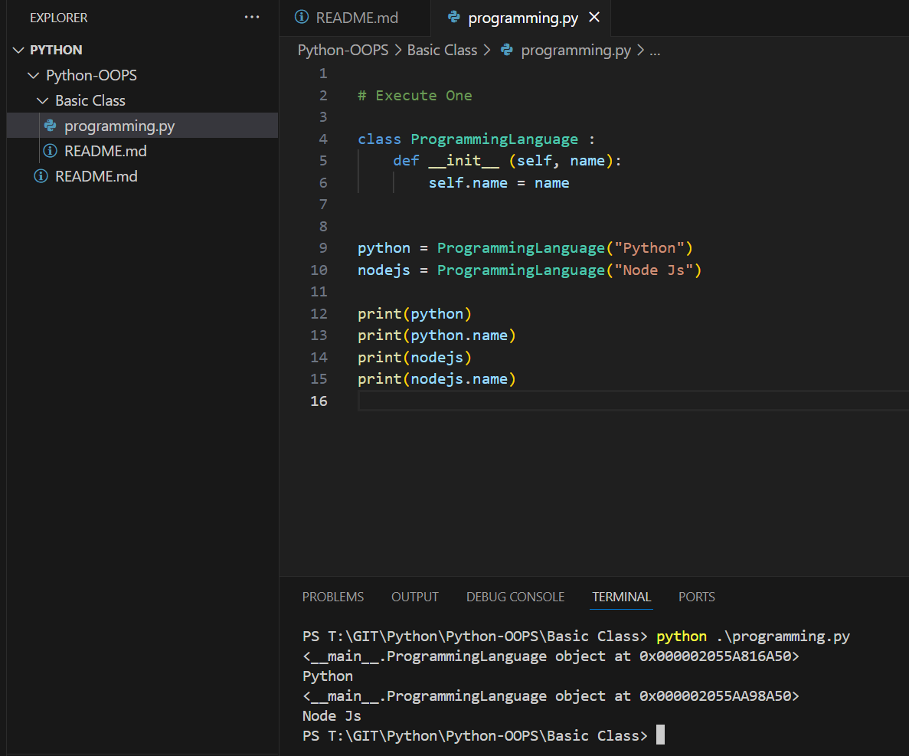
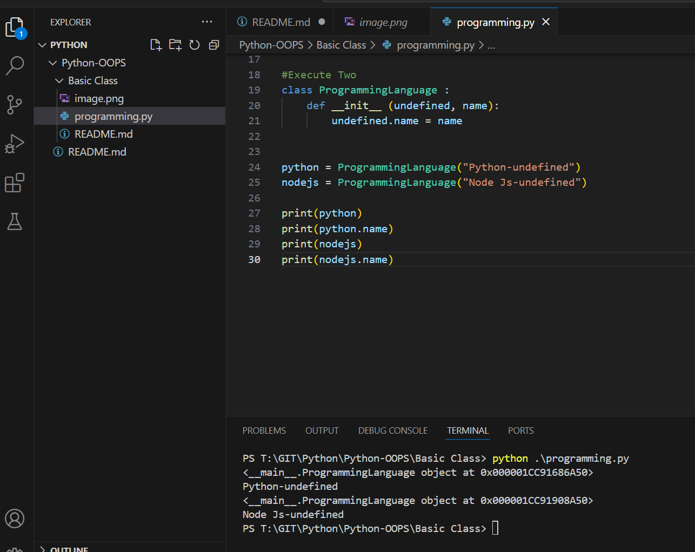

Execute One

```py
# Execute One

class ProgrammingLanguage :
    def __init__ (self, name):
        self.name = name


python = ProgrammingLanguage("Python")
nodejs = ProgrammingLanguage("Node Js")

print(python)
print(python.name)
print(nodejs)
print(nodejs.name)
        
```
Outcome


Execute Two

```py
#Execute Two
class ProgrammingLanguage :
    def __init__ (undefined, name):
        undefined.name = name


python = ProgrammingLanguage("Python-undefined")
nodejs = ProgrammingLanguage("Node Js-undefined")

print(python)
print(python.name)
print(nodejs)
print(nodejs.name)
```

Outcome
