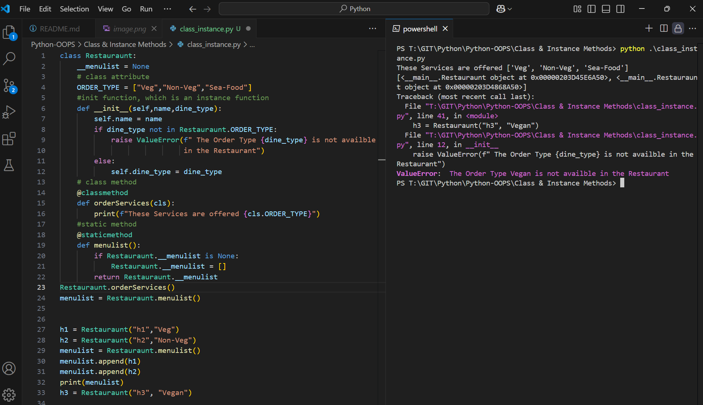

Execute
```py
class Restauraunt:
    __menulist = None
    # class attribute
    ORDER_TYPE = ["Veg","Non-Veg","Sea-Food"]
    #init function, which is an instance function
    def __init__(self,name,dine_type):
        self.name = name
        if dine_type not in Restauraunt.ORDER_TYPE:
            raise ValueError(f" The Order Type {dine_type} is not availble 
                             in the Restaurant")
        else:
            self.dine_type = dine_type
    # class method
    @classmethod
    def orderServices(cls):
        print(f"These Services are offered {cls.ORDER_TYPE}")
    #static method
    @staticmethod
    def menulist():
        if Restauraunt.__menulist is None:
            Restauraunt.__menulist = []
        return Restauraunt.__menulist
Restauraunt.orderServices()
menulist = Restauraunt.menulist()


h1 = Restauraunt("h1","Veg")
h2 = Restauraunt("h2","Non-Veg")
menulist = Restauraunt.menulist()
menulist.append(h1)
menulist.append(h2)
print(menulist)
h3 = Restauraunt("h3", "Vegan")
```


Outcome


