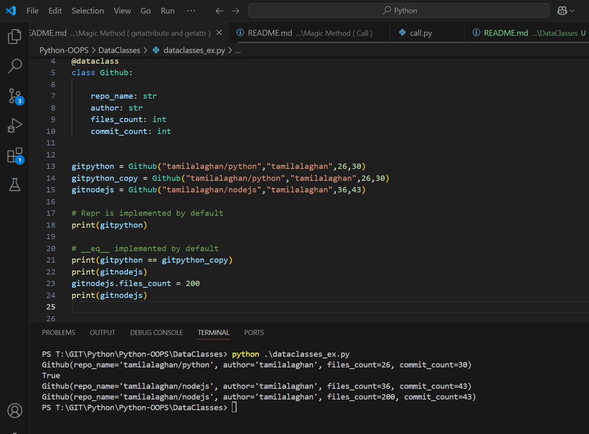

Execute

```py
@dataclass
class Github:

    repo_name: str
    author: str
    files_count: int
    commit_count: int


gitpython = Github("tamilalaghan/python","tamilalaghan",26,30)
gitpython_copy = Github("tamilalaghan/python","tamilalaghan",26,30)
gitnodejs = Github("tamilalaghan/nodejs","tamilalaghan",36,43)

# Repr is implemented by default
print(gitpython)

# __eq__ implemented by default
print(gitpython == gitpython_copy)
print(gitnodejs)
gitnodejs.files_count = 200
print(gitnodejs)
```

Outcome
