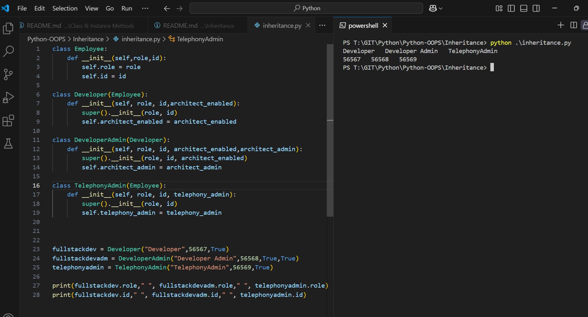

Execute
```py
class Employee:
    def __init__(self,role,id):
        self.role = role
        self.id = id

class Developer(Employee):
    def __init__(self, role, id,architect_enabled):
        super().__init__(role, id)
        self.architect_enabled = architect_enabled

class DeveloperAdmin(Developer):
    def __init__(self, role, id, architect_enabled,architect_admin):
        super().__init__(role, id, architect_enabled)
        self.architect_admin = architect_admin

class TelephonyAdmin(Employee):
    def __init__(self, role, id, telephony_admin):
        super().__init__(role, id)
        self.telephony_admin = telephony_admin


fullstackdev = Developer("Developer",56567,True)
fullstackdevadm = DeveloperAdmin("Developer Admin",56568,True,True)
telephonyadmin = TelephonyAdmin("TelephonyAdmin",56569,True)

print(fullstackdev.role," ", fullstackdevadm.role," ", telephonyadmin.role)
print(fullstackdev.id," ", fullstackdevadm.id," ", telephonyadmin.id)

```

Outcome
