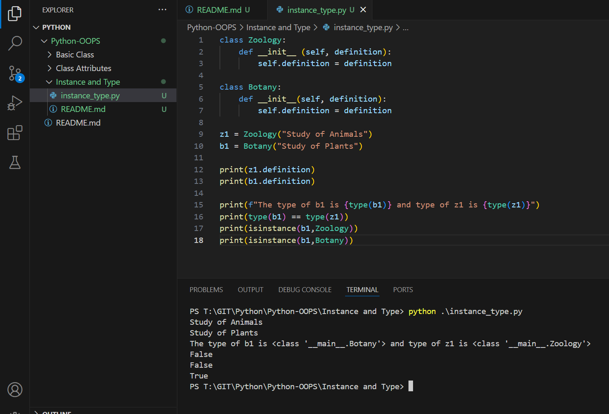

Execution
```py
class Zoology:
    def __init__ (self, definition):
        self.definition = definition

class Botany:
    def __init__(self, definition):
        self.definition = definition

z1 = Zoology("Study of Animals")
b1 = Botany("Study of Plants")

print(z1.definition)
print(b1.definition)

print(f"The type of b1 is {type(b1)} and type of z1 is {type(z1)}")
print(type(b1) == type(z1))
print(isinstance(b1,Zoology))
print(isinstance(b1,Botany))
```

Outcome
