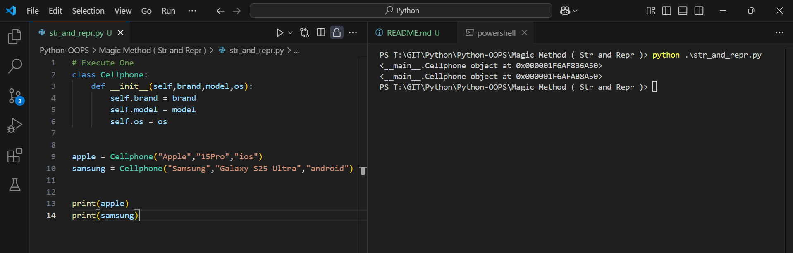
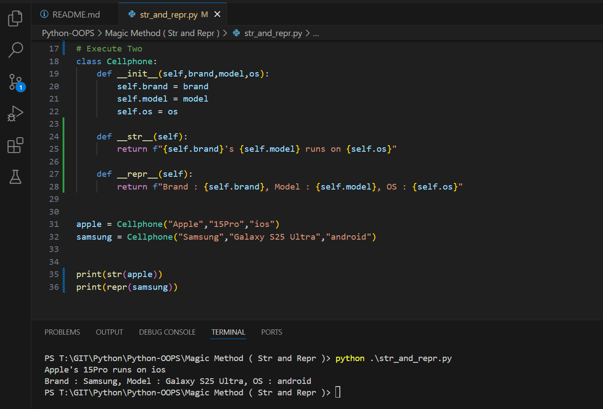
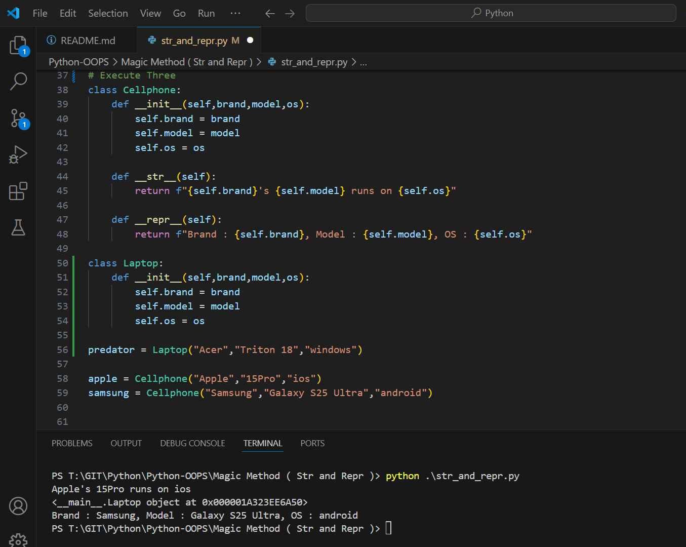

Execute One

```py
# Execute One
class Cellphone:
    def __init__(self,brand,model,os):
        self.brand = brand
        self.model = model
        self.os = os


apple = Cellphone("Apple","15Pro","ios")
samsung = Cellphone("Samsung","Galaxy S25 Ultra","android")


print(apple)
print(samsung)
```
Outcome


Execute Two

```py
# Execute Two
class Cellphone:
    def __init__(self,brand,model,os):
        self.brand = brand
        self.model = model
        self.os = os
    
    def __str__(self):
        return f"{self.brand}'s {self.model} runs on {self.os}"
   
    def __repr__(self):
        return f"Brand : {self.brand}, Model : {self.model}, OS : {self.os}"


apple = Cellphone("Apple","15Pro","ios")
samsung = Cellphone("Samsung","Galaxy S25 Ultra","android")


print(str(apple))
print(repr(samsung))
```


Execute Three

```py
# Execute Three
class Cellphone:
    def __init__(self,brand,model,os):
        self.brand = brand
        self.model = model
        self.os = os
    
    def __str__(self):
        return f"{self.brand}'s {self.model} runs on {self.os}"
   
    def __repr__(self):
        return f"Brand : {self.brand}, Model : {self.model}, OS : {self.os}"

class Laptop:
    def __init__(self,brand,model,os):
        self.brand = brand
        self.model = model
        self.os = os

predator = Laptop("Acer","Triton 18","windows")

apple = Cellphone("Apple","15Pro","ios")
samsung = Cellphone("Samsung","Galaxy S25 Ultra","android")
```
