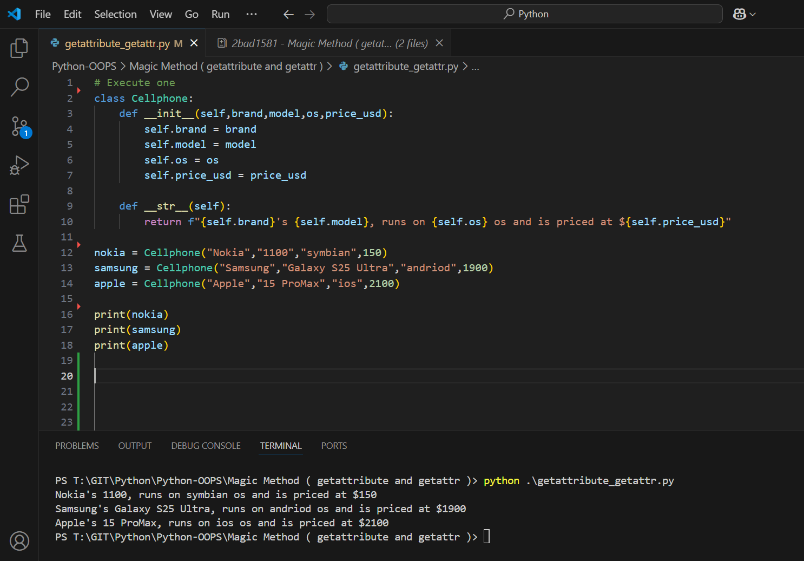
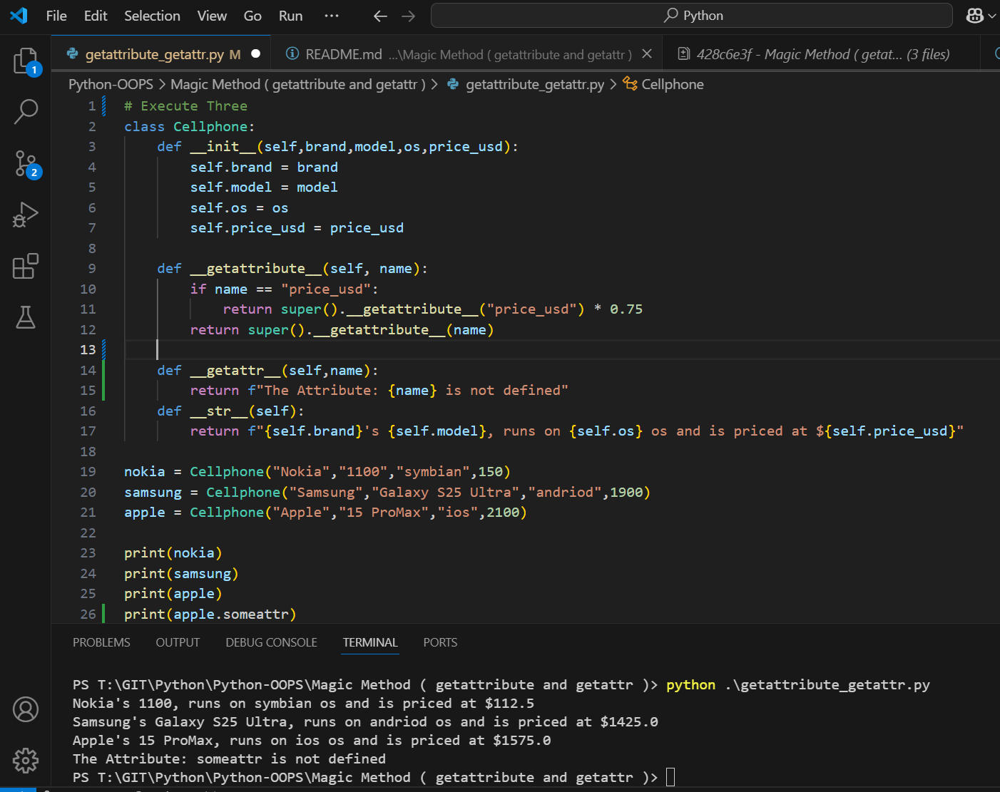

Execute One

```py
# Execute one
class Cellphone:
    def __init__(self,brand,model,os,price_usd):
        self.brand = brand
        self.model = model
        self.os = os
        self.price_usd = price_usd

    def __str__(self):
        return f"{self.brand}'s {self.model}, runs on {self.os} os and is priced at ${self.price_usd}"
    
nokia = Cellphone("Nokia","1100","symbian",150)
samsung = Cellphone("Samsung","Galaxy S25 Ultra","andriod",1900)
apple = Cellphone("Apple","15 ProMax","ios",2100)

print(nokia)
print(samsung)
print(apple)
```



Execute Two

```py
# Execute Two
class Cellphone:
    def __init__(self,brand,model,os,price_usd):
        self.brand = brand
        self.model = model
        self.os = os
        self.price_usd = price_usd
        
    def __getattribute__(self, name):
        if name == "price_usd":
            return super().__getattribute__("price_usd") * 0.75
        return super().__getattribute__(name)

    def __str__(self):
        return f"{self.brand}'s {self.model}, runs on {self.os} os and is priced at ${self.price_usd}"
    
nokia = Cellphone("Nokia","1100","symbian",150)
samsung = Cellphone("Samsung","Galaxy S25 Ultra","andriod",1900)
apple = Cellphone("Apple","15 ProMax","ios",2100)

print(nokia)
print(samsung)
print(apple)
```


Execute Three

```py
# Execute Three
class Cellphone:
    def __init__(self,brand,model,os,price_usd):
        self.brand = brand
        self.model = model
        self.os = os
        self.price_usd = price_usd
        
    def __getattribute__(self, name):
        if name == "price_usd":
            return super().__getattribute__("price_usd") * 0.75
        return super().__getattribute__(name)
    
    def __getattr__(self,name):
        return f"The Attribute: {name} is not defined"
    def __str__(self):
        return f"{self.brand}'s {self.model}, runs on {self.os} os and is priced at ${self.price_usd}"
    
nokia = Cellphone("Nokia","1100","symbian",150)
samsung = Cellphone("Samsung","Galaxy S25 Ultra","andriod",1900)
apple = Cellphone("Apple","15 ProMax","ios",2100)

print(nokia)
print(samsung)
print(apple)
print(apple.someattr)
```

