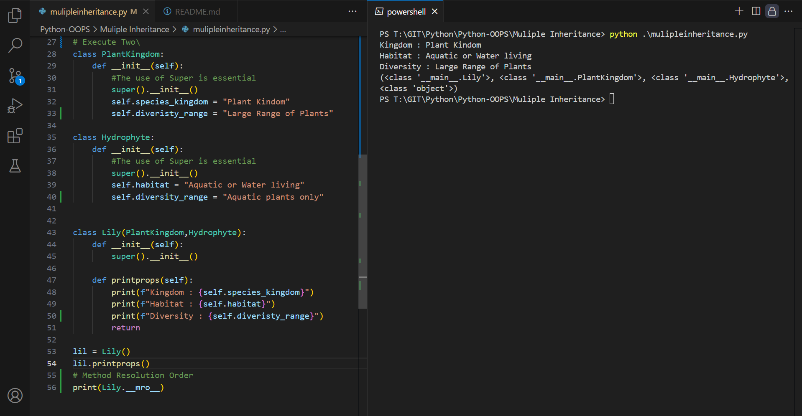
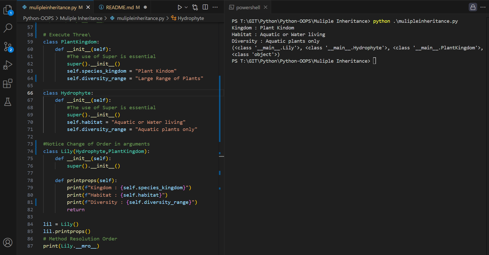

Execute One

```py
class PlantKingdom:
    def __init__(self):
        #The use of Super is essential
        super().__init__()
        self.species_kingdom = "Plant Kindom"

class Hydrophyte:
    def __init__(self):
        #The use of Super is essential
        super().__init__()
        self.habitat = "Aquatic or Water living"


class Lily(PlantKingdom,Hydrophyte):
    def __init__(self):
        super().__init__()
    
    def printprops(self):
        print(f"Kingdom : {self.species_kingdom}")
        print(f"Habitat : {self.habitat}")
        return

lil = Lily()
lil.printprops()
```

Outcome


Execute Two

```py
# Execute Two\
class PlantKingdom:
    def __init__(self):
        #The use of Super is essential
        super().__init__()
        self.species_kingdom = "Plant Kindom"
        self.diveristy_range = "Large Range of Plants"

class Hydrophyte:
    def __init__(self):
        #The use of Super is essential
        super().__init__()
        self.habitat = "Aquatic or Water living"
        self.diveristy_range = "Aquatic plants only"


class Lily(PlantKingdom,Hydrophyte):
    def __init__(self):
        super().__init__()
    
    def printprops(self):
        print(f"Kingdom : {self.species_kingdom}")
        print(f"Habitat : {self.habitat}")
        print(f"Diversity : {self.diveristy_range}")
        return

lil = Lily()
lil.printprops()
# Method Resolution Order
print(Lily.__mro__)
```

Outcome



Execute Three

```py
# Execute Three\
class PlantKingdom:
    def __init__(self):
        #The use of Super is essential
        super().__init__()
        self.species_kingdom = "Plant Kindom"
        self.diversity_range = "Large Range of Plants"

class Hydrophyte:
    def __init__(self):
        #The use of Super is essential
        super().__init__()
        self.habitat = "Aquatic or Water living"
        self.diversity_range = "Aquatic plants only"

#Notice Change of Order in arguments
class Lily(Hydrophyte,PlantKingdom):
    def __init__(self):
        super().__init__()
    
    def printprops(self):
        print(f"Kingdom : {self.species_kingdom}")
        print(f"Habitat : {self.habitat}")
        print(f"Diversity : {self.diversity_range}")
        return

lil = Lily()
lil.printprops()
# Method Resolution Order
print(Lily.__mro__)
```

Outcome
